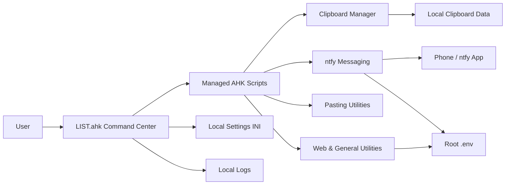

<div align="center">

# ⚡ AHK Advanced Command Center

### A polished Windows automation suite built with AutoHotkey v2

Manage scripts from one dashboard, keep a persistent clipboard history, send messages between your PC and phone, transform pasted text, and launch everyday utilities with a few keystrokes.

<p>
  
  
  
  
</p>

</div>

---

## ✨ What this project does

This repository is a modular collection of **AutoHotkey v2** automations centered around `LIST.ahk`, an advanced script-management dashboard.

From one interface, you can discover scripts recursively, search by name or description, monitor running processes, inspect shortcuts, launch or stop scripts, manage favorites, configure startup scripts, create backups, and add new scripts or folders.

The repository also includes:

- A persistent clipboard manager with text, image, binary, search, filtering, pinning, favorites, recycle-bin restoration, export, and backup support.
- Two-way PC ↔ phone messaging through **ntfy**.
- Automatic work-session notifications when Windows is locked or unlocked.
- Text transformation utilities for SQL, Excel, lists, and timestamps.
- Search, calculation, and autocomplete shortcuts.

---

## 🧭 Project architecture



---

## 🗂️ Repository structure

```text
AHK Scripts/
├── LIST.ahk                         # Main command center
├── .env                             # Local secrets and autocomplete values
├── .gitignore                       # Prevents private/runtime files being committed
├── AHK_CommandCenter_Settings.ini   # Favorites, startup choices, editor setting
├── LIST_LOGS.txt                    # Command-center activity log
├── LICENSE
│
├── CLIPBOARD/
│   ├── ClipboardHistoryManager.ahk  # Persistent clipboard manager
│   ├── ClipboardHistory.txt         # Human-readable clipboard mirror
│   └── ClipboardGodData/            # Database, images, backups, and settings
│
├── NTFY/
│   ├── ntfy.ahk                     # Send messages from PC to phone
│   ├── ntfy_listen.ahk              # Receive messages from phone on PC
│   ├── ntfy_lock.ahk                # Work/break tracking from lock events
│   └── Phone Inbox.txt              # Received-message history
│
├── PASTING/
│   ├── Comma.ahk
│   ├── TRIM().ahk
│   └── Undercore Pasting.ahk
│
└── FROM THE WEB/
    ├── AutoComplete.ahk
    ├── Calculator.ahk
    ├── Google Search.ahk
    └── Paste Timestamp.ahk
```

> Runtime files are created or updated automatically. Keep private data, logs, clipboard databases, and local settings out of version control.

---

## 🚀 Quick start

### 1. Install AutoHotkey v2

Install **AutoHotkey v2.0 or newer**. These scripts use v2 syntax and are not compatible with AutoHotkey v1.

### 2. Download or clone the project

```powershell
git clone <your-repository-url>
cd "AHK Scripts"
```

### 3. Make `LIST.ahk` portable

The current command-center file contains machine-specific paths. At the top of `LIST.ahk`, change:

```ahk
TargetFolder := "D:\Training\AG_Training_Umer\AHK Scripts"
LogFile := "D:\Training\AG_Training_Umer\AHK Scripts\LIST_LOGS.txt"
```

To:

```ahk
TargetFolder := A_ScriptDir
LogFile := A_ScriptDir "\LIST_LOGS.txt"
```

You may also configure a preferred editor:

```ahk
EditorPath := "C:\Users\YOUR_NAME\AppData\Local\Programs\Microsoft VS Code\Code.exe"
```

Leave `EditorPath` empty to use the default fallback editor.

### 4. Create the root `.env`

Create `.env` beside `LIST.ahk`:

```dotenv
# ntfy
NTFY_TOPIC=replace_with_a_long_unique_topic

# Autocomplete
AUTOCOMPLETE_EMAIL=your.email@example.com
AUTOCOMPLETE_PASSWORD=replace_with_your_value
AUTOCOMPLETE_SELECT=SELECT TOP 10 * FROM finance.
```

Scripts inside `NTFY` and `FROM THE WEB` load this shared file through:

```ahk
A_ScriptDir "\..\.env"
```

Restart any running script after changing `.env`.

### 5. Start the command center

Run:

```text
LIST.ahk
```

Then press:

```text
Alt + Q
```

The dashboard will scan the project recursively and display the available scripts.

---

## 🎛️ Command Center

`LIST.ahk` is the control plane for the entire repository.

### Main capabilities

| Capability | Description |
|---|---|
| Script discovery | Recursively indexes `.ahk` files and groups them by folder. |
| Search | Filters scripts by name, category, shortcut, and description. |
| Process monitoring | Shows running status, process ID, and memory usage. |
| Script actions | Run, stop, restart, edit, open folder, or launch all scripts. |
| Favorites | Maintains a dedicated favorites tab. |
| Startup group | Automatically launches selected scripts whenever `LIST.ahk` starts. |
| Backups | Creates timestamped copies before destructive operations or on demand. |
| Script creation | Creates new folders and AutoHotkey v2 script templates. |
| Metadata extraction | Reads shortcuts and `; Description:` comments from scripts. |
| Activity log | Records command-center actions and errors. |

### Dashboard tabs

- **All Scripts** — complete searchable script library.
- **Running** — scripts currently detected as active Windows processes.
- **Favorites** — scripts marked for quick access.

### Script descriptions

To make a script description appear in the dashboard, add this near the top of the file:

```ahk
; Description: Converts selected lines into comma-terminated values.
```

### Startup behavior

The command center’s **Startup** option means “run this script when `LIST.ahk` starts.” It does not automatically launch `LIST.ahk` when Windows starts.

To launch the suite at Windows sign-in:

1. Press `Win + R`.
2. Enter `shell:startup`.
3. Place a shortcut to `LIST.ahk` in that folder.

---

## 📋 Clipboard Manager

`CLIPBOARD/ClipboardHistoryManager.ahk` provides a persistent, searchable clipboard workspace.

### Highlights

- Captures text, images, rich content, binary clipboard data, URLs, code, and file references.
- Stores clipboard history between sessions.
- Searches, filters, and sorts saved items.
- Pins and favorites important entries.
- Edits text directly before copying or pasting.
- Combines multiple selected entries.
- Supports multi-delete and recycle-bin restoration.
- Exports selected items and creates scheduled backups.
- Preserves image aspect ratios in the preview panel.
- Supports configurable retention, duplicate handling, opacity, and paste delay.
- Excludes password managers and credential dialogs by default.

### Clipboard shortcuts

| Shortcut | Action |
|---|---|
| `Alt + V` | Open or hide clipboard manager |
| `Alt + Shift + V` | Pause or resume capture |
| `Alt + Shift + O` | Reset window opacity |
| `Enter` | Paste selected item |
| `Ctrl + Enter` | Copy selected item |
| `Delete` | Delete selected item(s) |
| `Ctrl + P` | Pin or unpin item |
| `Ctrl + Shift + P` | Favorite or unfavorite item |
| `Ctrl + F` | Focus search |
| `Ctrl + E` | Focus editor |
| `Ctrl + S` | Save edited content |
| `Ctrl + A` | Select all visible items |
| `Ctrl + Z` | Restore deleted item |
| `1`–`9` | Paste the corresponding visible item |
| `Esc` | Hide the window |

---

## 📱 ntfy integration

The `NTFY` folder turns ntfy into a lightweight bridge between your Windows PC and phone.

### PC → phone sender

`NTFY/ntfy.ahk`

- Opens an always-on-top message composer.
- Sends UTF-8 text to the configured topic.
- Splits long messages into safe, numbered parts.
- Preserves paragraph and word boundaries where possible.
- Displays success and failure status inside the window.

**Shortcut:** `Alt + W`

### Phone → PC receiver

`NTFY/ntfy_listen.ahk`

- Polls the configured topic every two seconds.
- Avoids replaying old cached messages at startup.
- Automatically copies incoming messages to the clipboard.
- Queues messages and displays always-on-top popups.
- Detects links inside messages and provides an **Open Link** action.
- Saves received messages to `NTFY/Phone Inbox.txt`.
- Includes tray-menu controls.

| Shortcut | Action |
|---|---|
| `Ctrl + Alt + R` | Check for messages immediately |
| `Ctrl + Alt + I` | Open phone-message history |

### Lock/unlock work timer

`NTFY/ntfy_lock.ahk`

- Sends a **WORK** notification when the session starts or unlocks.
- Sends a **BREAK** notification when the session locks or logs off.
- Includes the work-session start time, end time, and elapsed duration.
- Uses native Windows session-change notifications rather than continuous polling.

### ntfy setup

1. Install the ntfy app on your phone or use the ntfy web interface.
2. Subscribe to a long, difficult-to-guess topic.
3. Put the same topic in the root `.env` as `NTFY_TOPIC`.
4. Run the desired ntfy scripts from the command center.

> A topic name on the public `ntfy.sh` server should not be treated like a password-protected private channel. Use a long, unguessable topic or configure authenticated/self-hosted ntfy for sensitive data.

---

## ⌨️ Utility reference

| Script | Trigger | What it does |
|---|---|---|
| `LIST.ahk` | `Alt + Q` | Opens the AHK Advanced Command Center. |
| `ClipboardHistoryManager.ahk` | `Alt + V` | Opens or hides persistent clipboard history. |
| `ntfy.ahk` | `Alt + W` | Opens the PC-to-phone message composer. |
| `ntfy_listen.ahk` | `Ctrl + Alt + R` | Checks the ntfy topic immediately. |
| `ntfy_listen.ahk` | `Ctrl + Alt + I` | Opens the received-message history. |
| `AutoComplete.ahk` | `;email` | Types the email stored in `.env`. |
| `AutoComplete.ahk` | `;password` | Types the password value stored in `.env`. |
| `AutoComplete.ahk` | `;select` | Types the configured SQL query prefix. |
| `Calculator.ahk` | `=` | Opens a calculator prompt and types the rounded result. |
| `Google Search.ahk` | `Alt + G` | Searches Google for the currently selected text. |
| `Paste Timestamp.ahk` | `Alt + Shift + V` | Types the current date and time as `YYYY-MM-DD HH:MM:SS`. |
| `Comma.ahk` | `Ctrl + Alt + ,` | Adds a comma to every non-empty selected line and pastes it back. |
| `TRIM().ahk` | `Alt + W` | Converts selected text into `TRIM(value) AS value`. |
| `Undercore Pasting.ahk` | `Ctrl + Shift + B` | Splits clipboard text at the first underscore and pastes into adjacent Excel cells. |

Autocomplete hotstrings are activated after an ending character such as Space or Enter.

---

## ⚠️ Existing shortcut conflicts

Some scripts currently reuse the same shortcut. Do not run the conflicting scripts together unless you change one binding.

| Shortcut | Conflict |
|---|---|
| `Alt + W` | `NTFY/ntfy.ahk` and `PASTING/TRIM().ahk` |
| `Alt + Shift + V` | `ClipboardHistoryManager.ahk` and `Paste Timestamp.ahk` |

Example replacement:

```ahk
; Change Alt+W to Alt+Shift+W
!+w::ShowMessageWindow()
```

After changing a shortcut, restart the affected script.

---

## 🔐 Security and privacy

This project processes potentially sensitive clipboard content, messages, email addresses, and autocomplete values.

### Recommended `.gitignore`

```gitignore
# Secrets
/.env

# Command-center runtime data
/AHK_CommandCenter_Settings.ini
/LIST_LOGS.txt
/_CommandCenter_Backups/

# Clipboard history and binary content
/CLIPBOARD/ClipboardHistory.txt
/CLIPBOARD/ClipboardGodData/

# Received phone messages
/NTFY/Phone Inbox.txt
```

If a secret was previously committed, adding it to `.gitignore` is not enough. Stop tracking it and rotate the exposed value:

```powershell
git rm --cached .env
git add .gitignore
git commit -m "Stop tracking private runtime files"
git push
```

### Password autocomplete warning

`.env` is a plaintext file, and `AUTOCOMPLETE_PASSWORD` is loaded into the running script’s memory. For important accounts, a dedicated password manager with controlled autofill is safer than a global hotstring.

### Clipboard exclusions

The clipboard manager excludes common credential applications by default, including KeePass, KeePassXC, 1Password, Bitwarden, and Windows Credential UI. Review and expand the exclusion list in its settings for your environment.

---

## 🛠️ Customization

### Change a hotkey

AutoHotkey modifier symbols:

| Symbol | Key |
|---|---|
| `^` | Ctrl |
| `!` | Alt |
| `+` | Shift |
| `#` | Windows key |

Example:

```ahk
^!r::CheckForPhoneMessages()
```

means:

```text
Ctrl + Alt + R
```

### Add a script to the dashboard

Use **Add Script** inside the command center, or create a file manually:

```ahk
#Requires AutoHotkey v2.0
#SingleInstance Force

; Description: Explain the automation in one clear sentence.

^!x:: {
    MsgBox("Hello from AutoHotkey!")
}
```

Save it anywhere beneath the project root and refresh the command center.

### Add a startup script

1. Open the command center with `Alt + Q`.
2. Select the script.
3. Click **Startup**.
4. Restart `LIST.ahk` to verify automatic launch.

Favorites and startup selections are stored locally in `AHK_CommandCenter_Settings.ini`.

---

## 🧩 Requirements

| Requirement | Used by |
|---|---|
| Windows 10 or 11 | Entire project |
| AutoHotkey v2.0+ | All `.ahk` scripts |
| PowerShell | Calculator and clipboard image support |
| Internet access | Google Search and ntfy scripts |
| ntfy subscription/app | Phone messaging features |
| Excel or similar grid editor | Best experience with underscore split-paste utility |

---

## 🩺 Troubleshooting

<details>
<summary><strong>The command center shows the wrong folder or no scripts</strong></summary>

Set the root folder in `LIST.ahk`:

```ahk
TargetFolder := A_ScriptDir
```

Then restart `LIST.ahk`.

</details>

<details>
<summary><strong>A script reports that .env is missing</strong></summary>

The file must be located at the repository root, one directory above `NTFY` and `FROM THE WEB`:

```text
AHK Scripts/.env
```

Confirm that Windows has not silently named it `.env.txt`.

</details>

<details>
<summary><strong>An ignored file still appears in Git</strong></summary>

The file was already tracked. Remove it only from Git’s index:

```powershell
git rm --cached "path\to\file"
git commit -m "Stop tracking local file"
```

The local copy remains on your computer.

</details>

<details>
<summary><strong>A hotkey does nothing or the wrong script responds</strong></summary>

Check the conflict table above and inspect the AutoHotkey tray icons. Two simultaneously running scripts may be competing for the same shortcut.

</details>

<details>
<summary><strong>Phone messages are not arriving</strong></summary>

Verify that:

- `NTFY_TOPIC` exists in the root `.env`.
- The phone and PC use exactly the same topic.
- Internet access is available.
- The relevant ntfy script is running.
- The public ntfy service is reachable from the network.

</details>

---

## 🗺️ Suggested roadmap

- [ ] Remove remaining hardcoded paths from `LIST.ahk`.
- [ ] Add automatic duplicate-hotkey detection to the command center.
- [ ] Add native parsing for `Hotstring()` registrations.
- [ ] Move shared `.env` parsing into one reusable library.
- [ ] Add authenticated or self-hosted ntfy configuration.
- [ ] Add optional encrypted local storage for sensitive settings.
- [ ] Add screenshots or a short demonstration GIF.
- [ ] Add automated syntax checks for every `.ahk` file.

---

## 🤝 Contributing

Improvements are welcome. Keep additions modular, use AutoHotkey v2 syntax, add a clear `; Description:` comment, document every global shortcut, and avoid committing machine-specific paths or private runtime data.

---

## 📄 License

Released under the [MIT License](LICENSE).

Copyright © 2026 **Umer Amir**.

---

<div align="center">

### Built to turn repetitive Windows tasks into single-keystroke actions.

</div>
